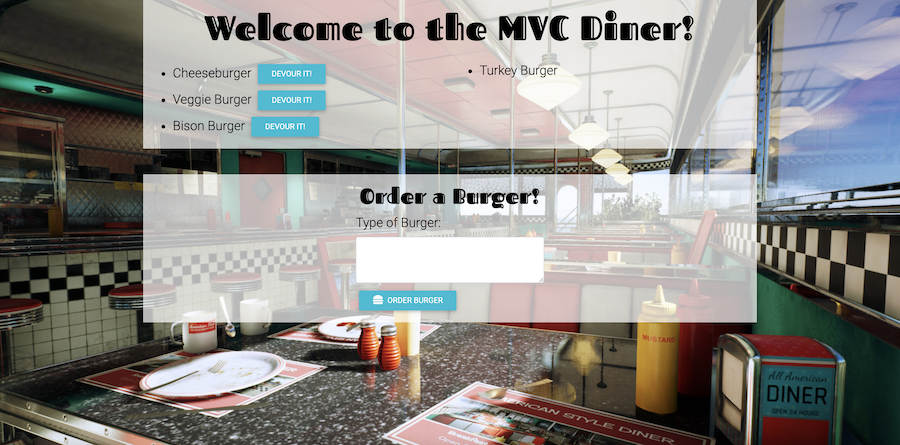

# Eat-Da-Burger

A full-stack application that allows users to add burgers to a dynamic list and then 'devour' them.

### Technologies Used
- JavaScript
- Node.js
- Express
- MySQL database
- Self-made ORM
- Handlebars.js
- jQuery
- CSS
- MD Bootstrap framework

Visit the deployed app on the Heroku platform: [The MVC Diner](https://salty-shore-33318.herokuapp.com/)

